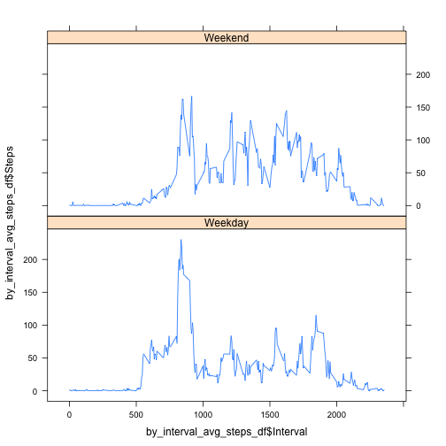

# Reproducible Research: Peer Assessment 1


## Loading and preprocessing the data

```r
library(reshape2)
library(timeDate)
library(lattice)

unzip("activity.zip")
activity = read.csv("activity.csv")
summary(activity)
```

```
##      steps               date          interval   
##  Min.   :  0.0   2012-10-01:  288   Min.   :   0  
##  1st Qu.:  0.0   2012-10-02:  288   1st Qu.: 589  
##  Median :  0.0   2012-10-03:  288   Median :1178  
##  Mean   : 37.4   2012-10-04:  288   Mean   :1178  
##  3rd Qu.: 12.0   2012-10-05:  288   3rd Qu.:1766  
##  Max.   :806.0   2012-10-06:  288   Max.   :2355  
##  NA's   :2304    (Other)   :15840
```

```r
by_days_steps_list = lapply(split(activity, activity$date), function(x) sum(x[, 
    c(1)]))
# convert list of dataframes into a dataframe
by_days_steps_df = melt(by_days_steps_list)
names(by_days_steps_df) = c("Steps", "Date")
```


## What is mean total number of steps taken per day?

```r
hist(by_days_steps_df$Steps, breaks = 40)
```

 


```r
activity$date = as.POSIXct(paste(activity$date, sprintf("%04d", activity$interval)), 
    format = "%Y-%m-%d %H%M")
r = as.POSIXct(round(range(activity$date), "hours"))
plot(as.POSIXct(by_days_steps_df$Date), by_days_steps_df$Steps, type = "h", 
    xaxt = "n", xlab = "", ylab = "Steps")
axis.POSIXct(side = 1, at = seq(r[1], r[2], by = "day"), format = "%Y-%m-%d", 
    las = 2)
```

 

```r
summary(by_days_steps_df$Steps)
```

```
##    Min. 1st Qu.  Median    Mean 3rd Qu.    Max.    NA's 
##      41    8840   10800   10800   13300   21200       8
```


The mean total number of steps taken per day is 1.0766 &times; 10<sup>4</sup>.   
Median is 10765

## What is the average daily activity pattern?

```r

by_interval_avg_steps_list = lapply(split(activity, activity$interval), function(x) mean(x[, 
    c(1)], na.rm = TRUE))

# convert list of dataframes into a dataframe
by_interval_avg_steps_list_df = melt(by_interval_avg_steps_list)
names(by_interval_avg_steps_list_df) = c("Steps", "Interval")

plot(by_interval_avg_steps_list_df$Interval, by_interval_avg_steps_list_df$Steps, 
    type = "l")
```

 


The 5-minute pattern that contains the max number of steps on average across all the days in the data set is 835


## Imputing missing values
Number of missing entries (for step column) is 2304  


```r
# use the mean of 5 minute interval to replace missing data in steps columns
activity = read.csv("activity.csv")
by_interval_split_list = lapply(split(activity, activity$interval), function(x) {
    x$steps[is.na(x$steps)] <- mean(x[, c(1)], na.rm = TRUE)
    x
})
full_activity = unsplit(by_interval_split_list, f = activity$interval)
summary(full_activity)
```

```
##      steps               date          interval   
##  Min.   :  0.0   2012-10-01:  288   Min.   :   0  
##  1st Qu.:  0.0   2012-10-02:  288   1st Qu.: 589  
##  Median :  0.0   2012-10-03:  288   Median :1178  
##  Mean   : 37.4   2012-10-04:  288   Mean   :1178  
##  3rd Qu.: 27.0   2012-10-05:  288   3rd Qu.:1766  
##  Max.   :806.0   2012-10-06:  288   Max.   :2355  
##                  (Other)   :15840
```


```r
# a histogram of the total number of steps taken each day
by_days_steps_list = lapply(split(full_activity, full_activity$date), function(x) sum(x[, 
    c(1)]))
# convert list of dataframes into a dataframe
by_days_steps_df = melt(by_days_steps_list)
names(by_days_steps_df) = c("Steps", "Date")

hist(by_days_steps_df$Steps, breaks = 40)
```

 


```r
full_activity$date = as.POSIXct(paste(full_activity$date, sprintf("%04d", full_activity$interval)), 
    format = "%Y-%m-%d %H%M")
r = as.POSIXct(round(range(full_activity$date), "hours"))
plot(as.POSIXct(by_days_steps_df$Date), by_days_steps_df$Steps, type = "h", 
    xaxt = "n", xlab = "", ylab = "Steps")
axis.POSIXct(side = 1, at = seq(r[1], r[2], by = "day"), format = "%Y-%m-%d", 
    las = 2)
```

 

```r
summary(by_days_steps_df$Steps)
```

```
##    Min. 1st Qu.  Median    Mean 3rd Qu.    Max. 
##      41    9820   10800   10800   12800   21200
```

The mean total number of steps taken per day is 1.0766 &times; 10<sup>4</sup>.   
Median is 1.0766 &times; 10<sup>4</sup>
No diffrenece comparing to a raw dataset with NAs.

## Are there differences in activity patterns between weekdays and weekends?

```r
# find weekdays/weekends full_activity$day=isWeekday(full_activity$date)
# full_activity$day[full_activity$day==TRUE] = 'Weekday'
# full_activity$day[full_activity$day==FALSE] = 'Weekend'
# full_activity$day=factor(full_activity$day)

# better code
full_activity$day = factor(ifelse(isWeekday(full_activity$date), "Weekday", 
    "Weekend"))
by_daytype_full_activity_list = split(full_activity, full_activity$day)
# by_interval_avg_steps_list=c(lapply(split(by_daytype_full_activity_list[['Weekday']],by_daytype_full_activity_list[['Weekday']]$interval
# ), function (x) list(Steps=mean(x[,c(1)], na.rm=TRUE), Day='Weekday') ),
# lapply(split(by_daytype_full_activity_list[['Weekend']],by_daytype_full_activity_list[['Weekend']]$interval
# ), function (x) list(mean(x[,c(1)], na.rm=TRUE), 'Weekend') ) )

by_interval_avg_steps_weekday_list = lapply(split(by_daytype_full_activity_list[["Weekday"]], 
    by_daytype_full_activity_list[["Weekday"]]$interval), function(x) list(Steps = mean(x[, 
    c(1)], na.rm = TRUE), Day = "Weekday"))

by_interval_avg_steps_weekend_list = lapply(split(by_daytype_full_activity_list[["Weekend"]], 
    by_daytype_full_activity_list[["Weekend"]]$interval), function(x) list(Steps = mean(x[, 
    c(1)], na.rm = TRUE), Day = "Weekend"))

# convert list into a dataframe
by_interval_avg_steps_df = do.call(rbind.data.frame, by_interval_avg_steps_weekday_list)
by_interval_avg_steps_df$Interval = rownames(by_interval_avg_steps_df)
by_interval_avg_steps_df$Interval = as.numeric(by_interval_avg_steps_df$Interval)

by_interval_avg_steps_weekend_df = do.call(rbind.data.frame, by_interval_avg_steps_weekend_list)
by_interval_avg_steps_weekend_df$Interval = rownames(by_interval_avg_steps_weekend_df)
by_interval_avg_steps_weekend_df$Interval = as.numeric(by_interval_avg_steps_weekend_df$Interval)

by_interval_avg_steps_df = rbind(by_interval_avg_steps_df, by_interval_avg_steps_weekend_df)

# plot(by_interval_avg_steps_df$Steps ,by_interval_avg_steps_df$Interval,
# type='l')
xyplot(by_interval_avg_steps_df$Steps ~ by_interval_avg_steps_df$Interval | 
    by_interval_avg_steps_df$Day, data = by_interval_avg_steps_df, layout = c(1, 
    2), type = "l")
```

 

```r

# xyplot(full_activity$steps ~ full_activity$date|full_activity$day,
# data=full_activity, layout=c(1,2), type='l')

```


